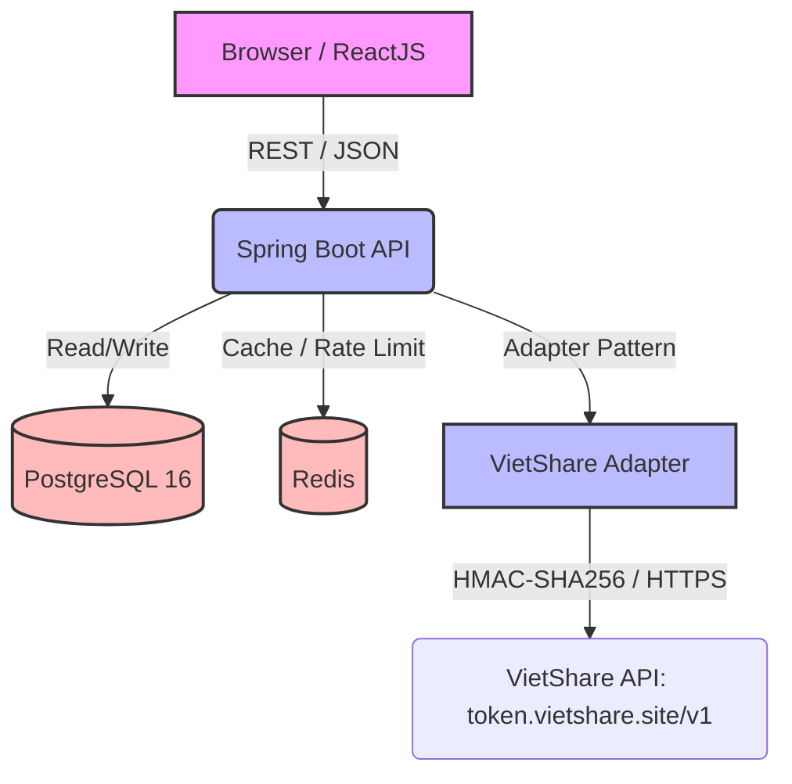
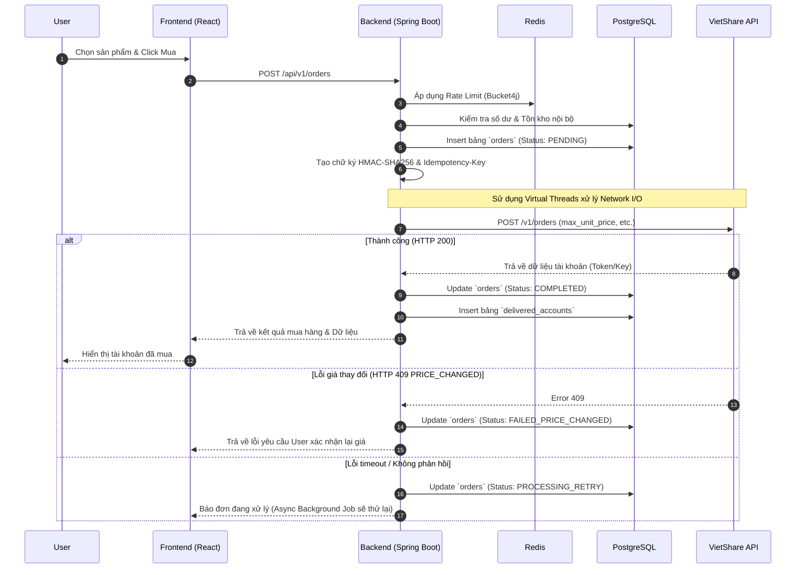

# 02 — Architectural Decision Records (ADR)

> Đây là file quan trọng nhất. Đọc trước khi code bất cứ thứ gì.
>
> **Mỗi quyết định ghi rõ: lý do + đánh đổi + giới hạn**. Agent không chỉ tuân theo luật — mà hiểu tại sao, để suy luận đúng trong tình huống chưa được định nghĩa.

---

## ADR-001: Không dùng Foreign Key ở tầng DB

- **Ngày quyết định:** 2026-07
- **Trạng thái:** Đã chốt ✅

**Lý do:**
- Tốc độ ghi (INSERT/UPDATE) trong môi trường nhiều đơn đồng thời — DB không phải tốn chi phí kiểm tra referential integrity.
- Dễ dàng Sharding/Partitioning sau này: dữ liệu phân mảnh qua nhiều node mà không bị khóa bởi FK constraint.
- Migration không downtime: xóa/đổi bảng không bị chặn bởi FK dependency.

**Cách đảm bảo toàn vẹn dữ liệu:**
- 100% tại tầng Service (Java Spring Boot): kiểm tra `existsById` trước khi thao tác.
- Background job định kỳ dò orphan record (đặc biệt `delivered_accounts` không có `orders` tương ứng).

**Đánh đổi:**
- Phải tự viết validation logic — dễ bỏ sót nếu không cẩn thận.
- Không có DB-level safety net: một bug ở Service layer có thể tạo ra dữ liệu không nhất quán.

> **⚠️ KHÔNG được tự đảo ngược quyết định này.** Nếu gặp tình huống cần FK, ghi vào `07-open-questions.md` và hỏi trước.

---

## ADR-002: Dùng Java 21 Virtual Threads (Project Loom)

- **Ngày quyết định:** 2026-07
- **Trạng thái:** Đã chốt ✅

**Lý do:**
- MDStore là I/O-bound nặng: mỗi đơn hàng cần gọi VietShare API (network I/O).
- Virtual Threads cho phép hàng chục nghìn request đồng thời với RAM tối thiểu, không cần quản lý thread pool phức tạp.

**Cách bật:**
```yaml
# application.yml
spring:
  threads:
    virtual:
      enabled: true
```

**Đánh đổi:**
- Không tương thích với một số library dùng `ThreadLocal` nặng (VD: MDC logging cần cẩn thận).
- Vẫn đang trong giai đoạn mature — một số edge case chưa được document đầy đủ.

> **⚠️ KHÔNG dùng `@Async` với thread pool thủ công** hay `ExecutorService` tự quản lý cho business logic. Nếu cần async, dùng Virtual Threads qua Spring's built-in support.

---

## ADR-003: HMAC-SHA256 cho mọi request ra VietShare

- **Ngày quyết định:** 2026-07
- **Trạng thái:** Đã chốt ✅

**Lý do:**
- VietShare yêu cầu ký số mọi request để chống MITM và Replay Attack.
- Request lệch quá 5 phút so với server VietShare bị từ chối tự động.

**Canonical String format (bắt buộc đúng thứ tự):**
```
timestamp|nonce|METHOD|PATH_WITH_QUERY|sha256(raw_body)
```

**Đánh đổi:**
- Mọi request phải có thêm bước tính chữ ký — tăng một chút latency.
- Nếu đồng hồ server lệch > 5 phút so với VietShare, tất cả request sẽ fail.

> **⚠️ KHÔNG được bỏ qua bước ký** dù là môi trường test. Dùng test API key riêng nếu cần.

---

## ADR-004: Adapter Pattern cho tích hợp nhà cung cấp

- **Ngày quyết định:** 2026-07
- **Trạng thái:** Đã chốt ✅

**Lý do:**
- Hiện tại chỉ có VietShare, nhưng roadmap sẽ thêm nhiều nhà cung cấp.
- Adapter Pattern giúp thêm nhà cung cấp mới bằng cách viết 1 class mới, không sửa business logic.

**Interface dự kiến:**
```java
interface SupplierAdapter {
    OrderResult createOrder(OrderRequest request);
    List<Product> getProductCatalog();
}
```

**Đánh đổi:**
- Thêm 1 lớp abstraction — phức tạp hơn một chút so với gọi thẳng VietShare.

---

## ADR-005: Idempotency-Key bắt buộc cho mọi lệnh tạo đơn

- **Ngày quyết định:** 2026-07
- **Trạng thái:** Đã chốt ✅

**Lý do:**
- Network timeout có thể xảy ra sau khi VietShare đã nhận và xử lý đơn hàng.
- Không có Idempotency-Key → có thể trừ tiền người dùng 2 lần cho 1 đơn.

**Quy tắc:**
- `Idempotency-Key` = UUID của đơn hàng nội bộ MDStore.
- Khi Retry, **bắt buộc giữ nguyên** `Idempotency-Key` của lần đầu tiên.
- VietShare giữ key này 24 giờ.

> **⚠️ KHÔNG được tạo `Idempotency-Key` mới khi retry.** Đây là bug nghiêm trọng.

---

## ADR-006: Retry với Exponential Backoff cho lỗi 429/5xx

- **Ngày quyết định:** 2026-07
- **Trạng thái:** Đã chốt ✅

**Lý do:**
- VietShare có rate limit 60 req/phút/IP.
- Lỗi 5xx từ VietShare thường là tạm thời.

**Chiến lược retry được phép:**
- Chỉ retry khi: Network Timeout, HTTP 429, HTTP 5xx.
- **Không retry** khi: HTTP 400, 401, 409 (PRICE_CHANGED, OUT_OF_STOCK) — đây là lỗi logic, không phải lỗi tạm thời.
- Thời gian backoff: 5s → 15s → 30s (tối đa 3 lần).

**Đánh đổi:**
- Đơn hàng ở trạng thái `PROCESSING_RETRY` có thể chờ tới 50 giây trước khi resolve.

---

## ADR-007: Response Envelope chuẩn cho mọi API backend → frontend

- **Ngày quyết định:** 2026-07-26
- **Trạng thái:** Đã chốt ✅

**Lý do:**
- VietShare và các supplier khác có response shape không đồng nhất giữa các endpoint.
- Frontend không nên biết supplier nào đang được dùng, và không nên phải handle nhiều format khác nhau.
- Cần 1 lớp translate bắt buộc tại tầng controller để chuẩn hoá.

**Format bắt buộc:**

```json
// Thành công
{
  "success": true,
  "data": { ... },
  "meta": {
    "timestamp": "2026-07-26T00:36:40Z"
  }
}

// Lỗi
{
  "success": false,
  "error": {
    "code": "PRICE_CHANGED",
    "message": "Giá sản phẩm đã thay đổi..."
  }
}
```

**Quy tắc:**
- `meta.timestamp` là ISO 8601 UTC — bắt buộc trong mọi response thành công.
  Dùng để frontend biết độ fresh của data (đặc biệt catalog cache 10–30s) và để debug/log.
- **Không thêm** `request_id`, `version` hay field phụ khác — giữ đơn giản.
- Mọi controller trong package `web/` phải trả envelope này.
- Raw response của supplier **không được lộ** ra ngoài envelope — kể cả field name.

**Đánh đổi:**
- Thêm một lớp wrapping ở mỗi controller — tăng nhẹ boilerplate.
- Nếu supplier thêm field mới, MDStore phải chủ động expose qua `data` thay vì auto-passthrough.

> **⚠️ KHÔNG trả raw supplier response thẳng từ controller**, dù là để debug. Dùng log file cho debug.

---

## Phụ lục A — Sơ Đồ Kiến Trúc Tổng Thể

> Diagram tham chiếu nhanh về các thành phần hệ thống và cách chúng kết nối.



---

## Phụ lục B — Sequence Diagram Luồng Mua Hàng

> Sequence diagram đầy đủ. Để biết xử lý từng nhánh (thành công / lỗi giá / timeout), xem [`05-business-flows.md`](./05-business-flows.md).



---

## Phụ lục C — Nguyên Lý Virtual Threads (ADR-002 — Chi tiết)

> Đây là lý giải kỹ thuật tại sao Virtual Threads phù hợp với MDStore — đọc khi cần hiểu sâu, không cần đọc để code thông thường.

MDStore là **I/O-bound nặng**: mỗi đơn hàng gọi VietShare API qua mạng. Với OS Thread truyền thống:
- Mỗi request chiếm 1 OS thread trong suốt thời gian chờ network.
- 1,000 request đồng thời = 1,000 OS thread = ~1GB RAM chỉ cho thread stack.

Với **Virtual Threads (Project Loom)**:
- Khi Virtual Thread đang chờ VietShare trả lời, nó **unmount** khỏi Carrier Thread (OS Thread).
- Carrier Thread được giải phóng để xử lý Virtual Thread khác ngay lập tức.
- 1,000 request đồng thời có thể chạy trên chỉ vài chục OS Thread.

**Lưu ý triển khai:**
- Bật bằng `spring.threads.virtual.enabled=true` — Spring Boot tự cấu hình toàn bộ thread pool.
- MDC (Mapped Diagnostic Context) cho logging hoạt động bình thường với Spring Boot 3.2+ khi Virtual Threads được bật.
- Tránh dùng `synchronized` block bọc I/O — có thể gây "pinning" (Virtual Thread bị pin vào Carrier Thread, mất lợi ích).
