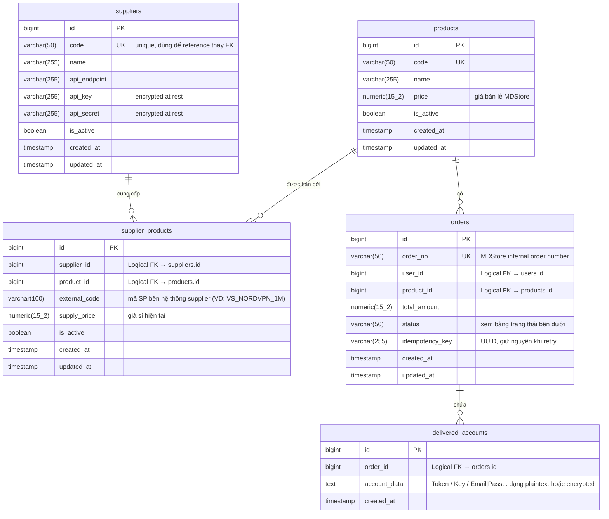

# 03 — Database Schema (Nguồn Sự Thật Duy Nhất)

> **Đọc file này thay vì tự suy ra schema từ code cũ** — code cũ có thể lỗi thời.
> Mọi thay đổi schema phải cập nhật vào đây TRƯỚC khi implement.

---

## Nguyên tắc cốt lõi

**NO FOREIGN KEY** ở mức DB — xem lý do tại [`02-decisions.md` ADR-001](./02-decisions.md#adr-001-không-dùng-foreign-key-ở-tầng-db).

Các cột có comment `-- Logical FK` là tham chiếu logic, KHÔNG phải FK thực sự.

---

## ERD



---

## Bảng trạng thái đơn hàng (`orders.status`)

| Status | Ý nghĩa | Bước tiếp theo |
|---|---|---|
| `PENDING` | Đơn vừa tạo, chưa gửi đến supplier | Gọi VietShare API |
| `COMPLETED` | VietShare trả hàng thành công | Không có |
| `FAILED_PRICE_CHANGED` | VietShare từ chối vì giá thay đổi | Hoàn tiền user / yêu cầu xác nhận giá mới |
| `FAILED_OUT_OF_STOCK` | VietShare báo hết hàng | Hoàn tiền user |
| `FAILED` | Lỗi khác không retry được | Hoàn tiền user, alert admin |
| `PROCESSING_RETRY` | Đang chờ retry (timeout / 429 / 5xx) | Background job retry với Exponential Backoff |

---

## DDL Script (Khởi tạo)

```sql
-- 1. Nhà cung cấp
CREATE TABLE suppliers (
    id          BIGSERIAL PRIMARY KEY,
    code        VARCHAR(50)  NOT NULL UNIQUE,
    name        VARCHAR(255) NOT NULL,
    api_endpoint VARCHAR(255),
    api_key     VARCHAR(255),  -- Lưu encrypted
    api_secret  VARCHAR(255),  -- Lưu encrypted
    is_active   BOOLEAN      DEFAULT TRUE,
    created_at  TIMESTAMP    DEFAULT CURRENT_TIMESTAMP,
    updated_at  TIMESTAMP    DEFAULT CURRENT_TIMESTAMP
);

-- 2. Sản phẩm nội bộ
CREATE TABLE products (
    id         BIGSERIAL PRIMARY KEY,
    code       VARCHAR(50)    NOT NULL UNIQUE,
    name       VARCHAR(255)   NOT NULL,
    price      NUMERIC(15, 2) NOT NULL,
    is_active  BOOLEAN        DEFAULT TRUE,
    created_at TIMESTAMP      DEFAULT CURRENT_TIMESTAMP,
    updated_at TIMESTAMP      DEFAULT CURRENT_TIMESTAMP
);

-- 3. Ánh xạ sản phẩm ↔ nhà cung cấp
CREATE TABLE supplier_products (
    id            BIGSERIAL PRIMARY KEY,
    supplier_id   BIGINT         NOT NULL, -- Logical FK → suppliers.id
    product_id    BIGINT         NOT NULL, -- Logical FK → products.id
    external_code VARCHAR(100)   NOT NULL, -- Mã SP bên VietShare (VD: VS_NORDVPN_1M)
    supply_price  NUMERIC(15, 2) NOT NULL,
    is_active     BOOLEAN        DEFAULT TRUE,
    created_at    TIMESTAMP      DEFAULT CURRENT_TIMESTAMP,
    updated_at    TIMESTAMP      DEFAULT CURRENT_TIMESTAMP
);

-- 4. Đơn hàng
CREATE TABLE orders (
    id               BIGSERIAL PRIMARY KEY,
    order_no         VARCHAR(50)    NOT NULL UNIQUE,
    user_id          BIGINT         NOT NULL,     -- Logical FK → users.id
    product_id       BIGINT         NOT NULL,     -- Logical FK → products.id
    total_amount     NUMERIC(15, 2) NOT NULL,
    status           VARCHAR(50)    NOT NULL,
    idempotency_key  VARCHAR(255),
    created_at       TIMESTAMP      DEFAULT CURRENT_TIMESTAMP,
    updated_at       TIMESTAMP      DEFAULT CURRENT_TIMESTAMP
);

-- 5. Tài khoản đã giao
CREATE TABLE delivered_accounts (
    id           BIGSERIAL PRIMARY KEY,
    order_id     BIGINT    NOT NULL, -- Logical FK → orders.id
    account_data TEXT      NOT NULL, -- Token / Key / Email|Pass
    created_at   TIMESTAMP DEFAULT CURRENT_TIMESTAMP
);
```

---

## Indexes

> Do không có FK (không auto-create index), phải tự tạo đủ index cho các query phổ biến.

```sql
-- Tìm đơn hàng theo user và trạng thái (query phổ biến nhất)
CREATE INDEX idx_orders_user_status
    ON orders (user_id, status);

-- Thống kê đơn hàng theo thời gian
CREATE INDEX idx_orders_created_at
    ON orders (created_at DESC);

-- Idempotency check (phải unique, chỉ apply khi có giá trị)
CREATE UNIQUE INDEX idx_orders_idempotency
    ON orders (idempotency_key)
    WHERE idempotency_key IS NOT NULL;

-- Tra cứu sản phẩm theo nhà cung cấp
CREATE INDEX idx_supplier_products_sid_pid
    ON supplier_products (supplier_id, product_id);

-- Tra cứu tài khoản đã giao theo đơn hàng
CREATE INDEX idx_delivered_accounts_order_id
    ON delivered_accounts (order_id);
```

---

## Quy ước đặt tên

| Đối tượng | Convention | Ví dụ |
|---|---|---|
| Bảng | `snake_case`, số nhiều | `orders`, `supplier_products` |
| Cột | `snake_case` | `order_no`, `created_at` |
| PK | `id` (BIGSERIAL) | `id` |
| UK | `{tên_cột}` + UNIQUE constraint | `code UNIQUE` |
| Index | `idx_{bảng}_{cột(s)}` | `idx_orders_user_status` |
| Logical FK | Comment `-- Logical FK → {bảng}.{cột}` | `-- Logical FK → suppliers.id` |
| Status enum | `SCREAMING_SNAKE_CASE` | `PROCESSING_RETRY` |

---

## Ghi chú tương lai

- `users` table chưa được define — khi implement auth, cập nhật ERD vào đây trước.
- `api_key` và `api_secret` trong bảng `suppliers` cần encryption at rest — cơ chế chưa chốt, xem [`07-open-questions.md`](./07-open-questions.md).
